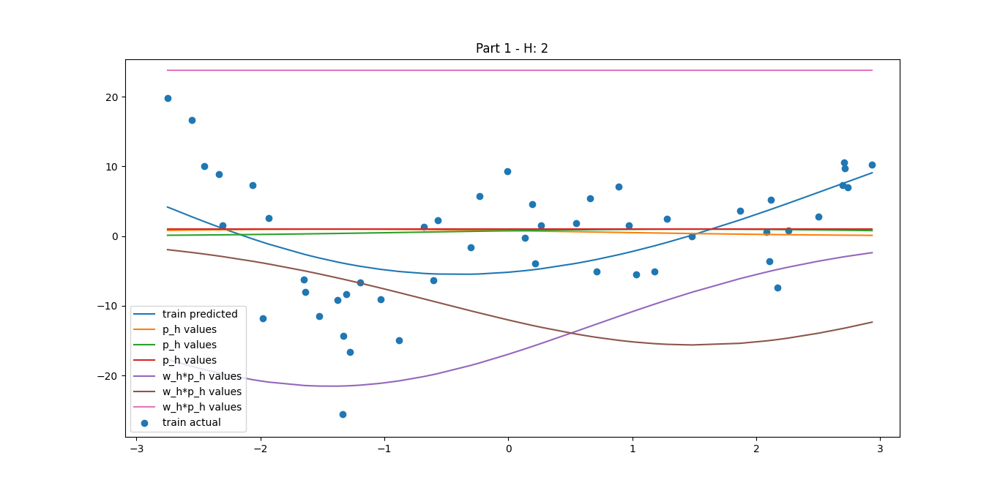
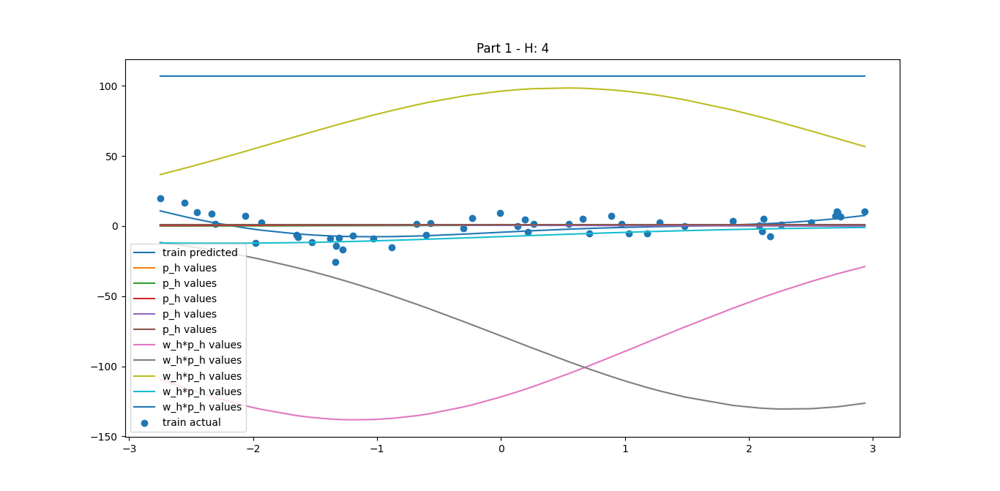
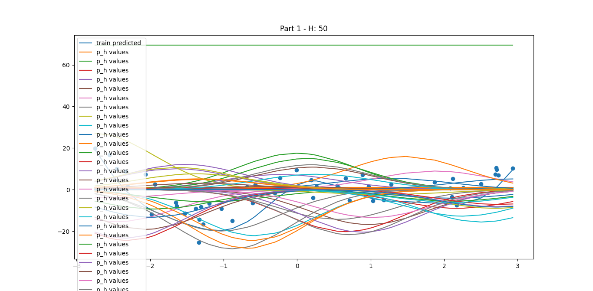
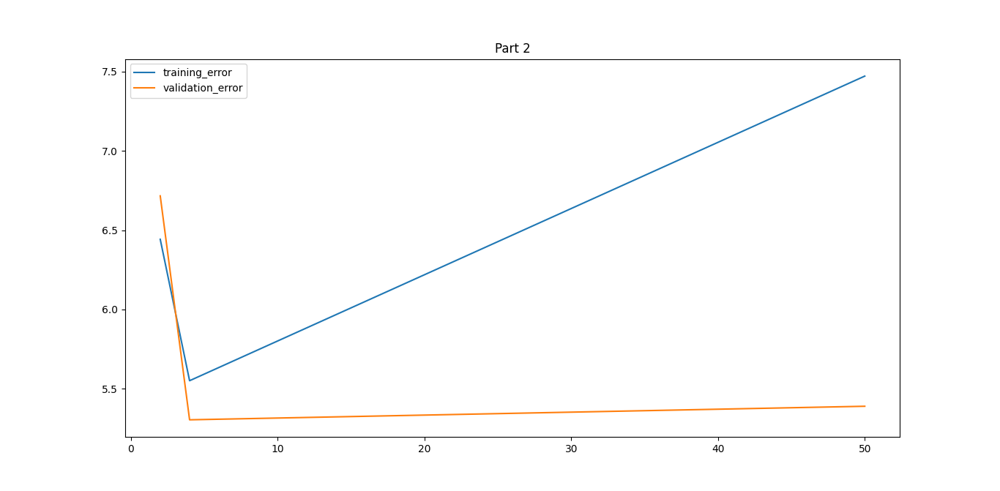

# CMP5133 - ARTIFICAL NEURAL NETWORKS

I used hybrid method to build RBF. At first part I used Minibatch Kmeans clustering model to find clusters and I
experimented with 2, 4 and 50 clusters. As spread value of each neuron, I used 2 most distinct point in each cluster
and calculated distance between them. Also other parameters are: learning rate = 0.1, epoch for every model = 1000

My experiments showed that model with 4 neurons in the hidden layer is the most successful one. Model with 2
neuron in hidden layer underfits and with 50 neuron overfits.
To achive better results, the gaussian function which is used to find p_h values, can be replaced with a better
function because in my experiments I saw that for some points the far cluster returned greater value than a closer
cluster which we don’t want.

As result of my experiments the graphs below can be seen.

